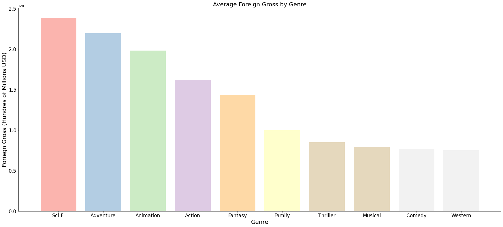
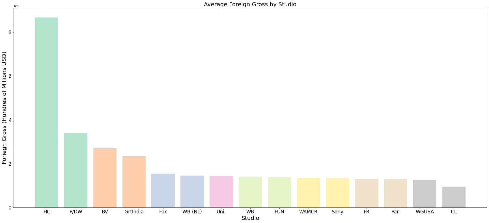
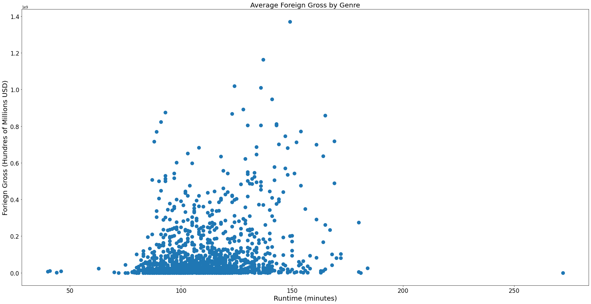

# Overview

Microsoft is planning to launch and develop a new movie studio to develop a new source of revenue and profit.

Analayzing publically available databases on thousands of films, we have a strong understanding of some of the variables that makes it a strong return on investment. 

# Business Understanding

* What movie types or genres being in the most revenue?

* What studios are the most profitable?

* How long should each movie be approximately in length?

# Data Understanding 

There are several publically data sets that were used for this analysis:

*[Box Office Mojo](https://www.boxofficemojo.com/)

*[IMDB](Imdb.com)

The Box Office Mojo primarily consisted of film title, gross domestic reveanue, gross forgien revenue, and studio.
The IMDB database contains detailed information regarding film title, languages, genres, ratings, and casting.

We evaluated these databases for several metrics that could be associated with larger market revenue.

# Methods

*
*
*
*

# Data Analysis

Using the data sample lsited above, we analyzed it for trends in movie genre, run time, and studio.

# Conclusion

Based on our analysis, we have determined in order to develop a movie with the most sales it should:

1. Have the Genre: Sci-fi, Adventure, or Animation - as they are the genres that generate the most foreign gross revenue

2. Be developped by HC, but if not, P/DW, BV, or GrtIndia are other good options

3. Finally, as far as runtime, the movie should on the longerside, from 100 to 150 minutes

